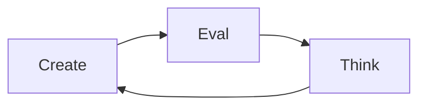

# Jev Score

[](https://github.com/a-Fig/jev-score/actions/workflows/ci.yml)
[](https://github.com/a-Fig/jev-score/releases/latest)
[](https://nodejs.org/)
[](./LICENSE)

## Jev Score - Unit tests for writing

Jev-Score enables Claude to optimize writing against a deterministic evaluator paired with natural language writing objectives.

Jev-score scores documents against the context they must satisfy and the subjective questions that define "good".

It is a local CLI + web app tool to enhance the writing of coding agents. Think resume against a job posting, an essay against its prompt, a spec against requirements, a landing page against its positioning. [TypeSafe's Jev model](https://www.typesafe.ai/) does the scoring through OpenRouter; drafts and scores stay in local SQLite.


**Jump to:** [Install](#install) · [First score](#your-first-score) · [Concepts](#concepts) · [Agent loop](#the-agent-loop) · [Limits](#honest-limits)

### Practical example

Give Claude a resume, the job posting, and an evaluation group you wrote:

```text
This resume is a strong fit for the job
This resume would land an interview
This resume would pass an ATS scan
This resume is well organized 
This resume has obvious red flags
This resume is at the right seniority level for the role
```

Jev looks at the job posting & resume, and assigns each question in the evaluation group a score between 0-100 based on how much Jev agrees with the statement. Claude then reviews the scores, and creates a new document with the goal of getting a better score. 

```text
original resume       83.2
revised resume        96.6 
```

The score gives Claude a stable target and shows whether and how each rewrite improved the resume.

- **Your target.** The agent optimizes for the exact objectives you chose.
- **A separate evaluator.** Claude writes; [TypeSafe's Jev model](https://www.typesafe.ai/) scores through OpenRouter.
- **Every attempt stays visible.** Local SQLite history preserves improvements, regressions, and repeated runs.

The same loop can improve an essay against its assignment, a product spec against its requirements, or a landing page against its positioning brief.

## Evidence: this project's own README

That screenshot is a real workspace holding this project's README: 3 drafts, 14 evaluations, scored by an "Open-source README quality" group. Documents panel in "highest" mode, question columns abbreviated:

| Draft | Overall | Engaging? | Clear in 10s? |
| --- | --- | --- | --- |
| [Original README](https://github.com/a-Fig/jev-score/blob/733cd5b6cdf2ed3125e39d434f4c1d570efb031d/README.md) | 85.5 | 75.5 | 90.3 |
| This README | 92.1 | 82.0 | 93.3 |

The chart dips where a rewrite came out worse; those runs are kept too. The original README is linked in the table (pinned to its first commit) so you can read it next to this one.

## Install

You need Node.js 22.13 or newer and an OpenRouter API key with access to Jev. There are no runtime dependencies.

```bash
git clone https://github.com/a-Fig/jev-score.git
cd jev-score
npm install --global .          # puts `jev-score` on your PATH
cp .env.example .env.local      # PowerShell: Copy-Item .env.example .env.local
```

The global install links to this checkout, so keep the folder in place. Put your key in `.env.local`:

```dotenv
OPENROUTER_API_KEY=your_key_here
OPENROUTER_JEV_MODEL=typesafe/jev-1.13
```

`.env.local` is read only from the directory you run `jev-score` in. To run it from anywhere, set `OPENROUTER_API_KEY` in your shell instead. Then `jev-score ui` opens the app at `http://127.0.0.1:4317` (`--port <number>` to change it), and `jev-score --help` lists every command.

## Your first score

Three commands, run from the repo so the example paths resolve.

```bash
# 1. The questions that define "good"
jev-score group create --name "Resume review" \
  --questions ./examples/resume/questions.txt

# 2. A workspace built around the job posting
jev-score workspace create --name "Product writer" \
  --context ./examples/resume/job-posting.md \
  --context-title "Job posting" \
  --group "Resume review"

# 3. Save and score the example resume
jev-score score "Product writer" ./examples/resume/resume.md \
  --title "Original resume"
```

The third command prints JSON. A real run (5 questions, 3 shown):

```json
{
  "documentTitle": "Original resume",
  "status": "success",
  "overallScore": 83.2,
  "scores": [
    { "text": "Does the resume demonstrate strong fit for the role?", "score": 89.5 },
    { "text": "Does the resume use specific, credible evidence?", "score": 76 },
    { "text": "Does the resume feel authentic?", "score": 77.8 }
  ]
}
```

Evidence and authenticity are the weak spots, so that is where the next draft goes.

## Concepts

| Term | Meaning |
| --- | --- |
| **Context** | The text a document must satisfy: a job posting, prompt, or requirements doc. One per workspace. |
| **Workspace** | That context plus every revision of the document and all their scores. |
| **Document** | One stored draft: `#0` is the first draft stored (the original), then `#1`, `#2`, and so on, each with an optional change summary and parent. |
| **Evaluation group** | A reusable list of questions plus the scorer that folds them into one number: a mean by default, with lower-is-better questions counted as `100 - score`. Only its name can be edited later; to change the questions, make a new group. |
| **Run** | One evaluation of one document under one group: 0-100 per question, plus the overall. Scoring a document again adds a run, not a document. |
| **Ranking mode** | `max` (default) ranks each document by its best run; `median` ranks by its middle run and rewards stability. Switch with `jev-score workspace mode <workspace> median` or the UI toggle. |

## The agent loop

Your agent **creates** a draft, Jev Score **evaluates** it, and the agent **thinks** about which questions fell short before creating the next one.



Everything your agent needs has a JSON-printing CLI command (the chart and diff views are UI-only), so one turn looks like this:

```bash
# create: save a revision, with what changed and where it came from
jev-score document add "Product writer" ./resume-v2.md \
  --title "Quantified outcomes" \
  --summary "Added measured outcomes and provenance" \
  --parent "Original resume"

# eval: score it, more than once
jev-score score "Product writer" "Quantified outcomes" --note "iteration 1"

# think: rank the drafts overall, then by a single question
# (keys are listed by `jev-score group show <group>`)
jev-score rank "Product writer"
jev-score rank "Product writer" --question does-the-resume-feel-authentic
```

On the bundled example, with a revision aimed at those two weak questions (written by an agent, not shipped in the repo), `rank` printed (trimmed):

```json
{
  "mode": "max",
  "items": [
    { "title": "Quantified outcomes", "runs": 3, "median": 96.6, "spread": 0.2, "rankScore": 96.7, "delta": 13.2 },
    { "title": "Original resume", "runs": 3, "median": 83.2, "spread": 0.6, "rankScore": 83.5, "delta": 0 }
  ]
}
```

Evidence went 76 to 99.3 and authenticity 77.8 to 96.3; spreads of 0.6 and 0.2 put the 13.2-point `delta` well outside the noise. The repo ships an [agent skill](./.agents/skills/jev-score/SKILL.md) that teaches this loop to your agent.

## Honest limits

- **Scores are noisy.** Jev is probabilistic. Score anything that matters more than once and read the spread; a one- or two-point gap is not a result.
- **Your text leaves the machine to be scored.** The document, context, and questions go to OpenRouter. Nothing else from your workspace does.
- **Single user, localhost only.** The server binds to `127.0.0.1`. No authentication, no hosted mode, and anyone with your OS account can read the database.
- **Text and Markdown only.** Convert PDF or Word files first.
- **Custom scorers are trusted local JavaScript.** They run in a worker with a timeout, not a sandbox.
- **Independent project**, MIT licensed, not affiliated with TypeSafe or OpenRouter.

`jev-score db path` prints the database location (`JEV_SCORE_DB` or `JEV_SCORE_DATA_DIR` moves it); `workspace delete --yes` and `db reset --yes` clean up. `jev-score usage` shows the Jev tokens and costs recorded locally.

## Where next

- [Custom scorers](./docs/custom-scorers.md): weight questions or apply your own formula with a JavaScript function (CLI only). Mark a question lower-is-better by prefixing its line with `[lower]` in a text question file; see `jev-score --help`.
- [CONTRIBUTING.md](./CONTRIBUTING.md): run `npm test` and `npm run pack:check` before a pull request.
- [SECURITY.md](./SECURITY.md): report vulnerabilities privately through GitHub security advisories.
