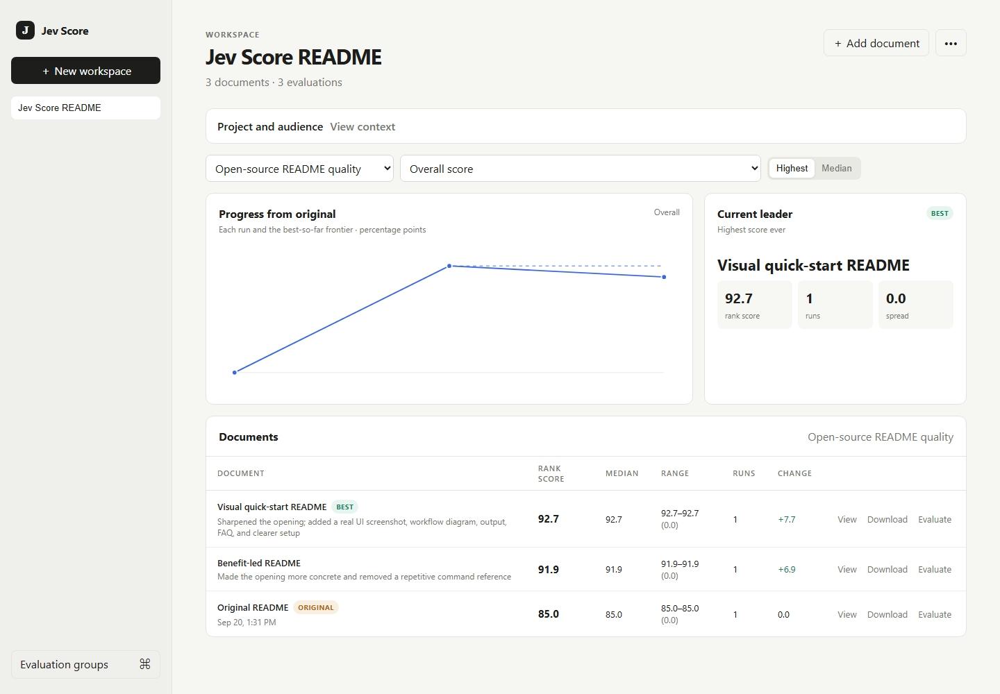
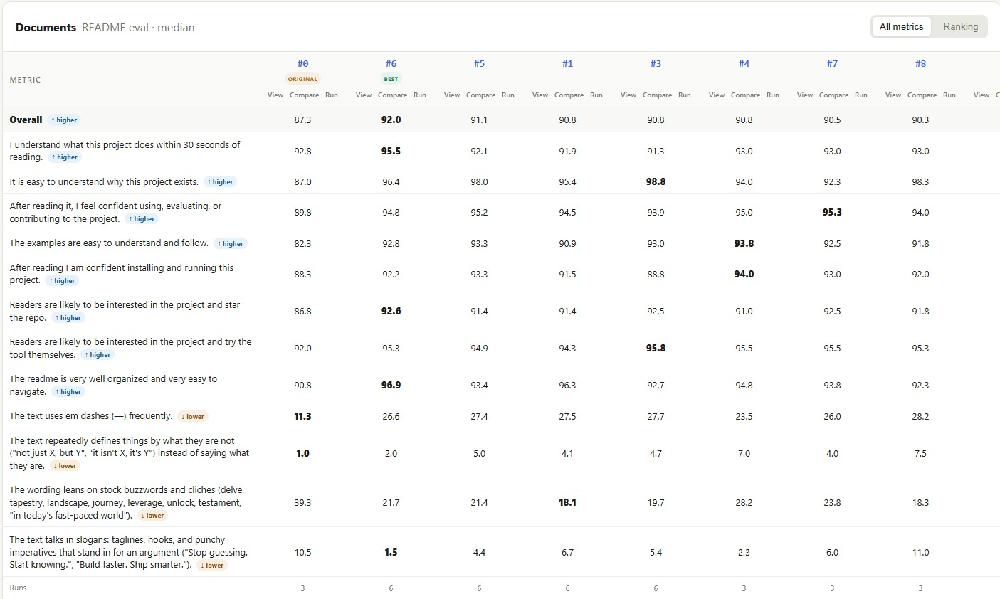

# Jev Score

[](https://github.com/a-Fig/jev-score/actions/workflows/ci.yml)
[](https://github.com/a-Fig/jev-score/releases/latest)
[](https://nodejs.org/)
[](./LICENSE)

## What Jev Score does

Jev Score is a local command line tool and web app that scores drafts of a document against a context and a list of questions. It is meant for developers who let Codex or Claude Code edit their text. The agent writes a draft, Jev Score returns a number for each question, and the agent uses those numbers to write the next draft.

Typical pairings are a resume and a job posting, a college essay and its prompt, or a cold email and the reader's background. [TypeSafe's Jev model](https://www.typesafe.ai/) does the scoring through OpenRouter. Every draft and every score is stored in a local SQLite database and shown in the web UI.



**Jump to:** [Install](#install) · [First score](#your-first-score) · [Concepts](#concepts) · [Agent loop](#the-agent-loop) · [Limits](#honest-limits)

### Example: a resume

You give the agent a resume, the job posting, and questions you wrote:

```text
This resume is a strong fit for the job
This resume would land an interview
This resume would pass an ATS scan
This resume is well organized
This resume has obvious red flags
This resume is at the right seniority level for the role
```

Jev reads the posting and the resume, then gives each question a score from 0 to 100 for how strongly it agrees with the statement. The agent reads the scores, rewrites the resume, and submits it for scoring again:

```text
original resume       83.2
revised resume        96.6
```

The same loop works for an essay and its assignment, a product spec and its requirements, or a landing page and its positioning brief.

## Evidence: this project's own README

This README was picked by scoring it against its alternatives. Nine drafts (the original, the previous version, and seven rewrites) went through one evaluation group of 12 questions. Eight questions have higher as better, such as "I understand what this project does within 30 seconds of reading". Four have lower as better: em dashes, defining things by what they are not, stock buzzwords, and slogans. Each draft was scored 3 to 6 times, and the Documents panel below is in "median" mode:



Columns are numbered by draft. #0 is the original README, #1 is the previous README, and #6 is this one, which had the highest overall median. The other columns are alternative rewrites that scored lower.

| Draft | Overall | Easy to see why the project exists | Well organized |
| --- | --- | --- | --- |
| [Original README (#0)](https://github.com/a-Fig/jev-score/blob/733cd5b6cdf2ed3125e39d434f4c1d570efb031d/README.md) | 87.3 | 87.0 | 90.8 |
| [Previous README (#1)](https://github.com/a-Fig/jev-score/blob/6ad856e1d60fa51b62ec5f051d26c5602ec2bc12/README.md) | 90.8 | 95.4 | 96.3 |
| This README (#6) | 92.0 | 96.4 | 96.9 |

The lead over the previous README is 1.2 points. Across 6 runs each, the ranges did not overlap (91.3 to 92.1 for this README, 90.6 to 91.0 for the previous one), but Jev is probabilistic, so treat a gap that small as a modest edge. The original and previous READMEs are linked in the table, pinned to commits, so you can read them next to this one.

## Install

You need Node.js 22.13 or newer and an OpenRouter API key with access to Jev. The package declares zero runtime dependencies.

```bash
git clone https://github.com/a-Fig/jev-score.git
cd jev-score
npm install --global .          # puts `jev-score` on your PATH
cp .env.example .env.local      # PowerShell: Copy-Item .env.example .env.local
```

The global install links to this checkout, so keep the folder in place. Put your key in `.env.local`:

```dotenv
OPENROUTER_API_KEY=your_key_here
OPENROUTER_JEV_MODEL=typesafe/jev-1.13
```

`jev-score` reads `.env.local` from the directory you run it in. To run it from another directory, set `OPENROUTER_API_KEY` in your shell instead. Then `jev-score ui` opens the app at `http://127.0.0.1:4317` (`--port <number>` changes the port), and `jev-score --help` lists every command.

## Your first score

Three commands, run from the repo so the example paths resolve.

```bash
# 1. The questions that define a good resume
jev-score group create --name "Resume review" \
  --questions ./examples/resume/questions.txt

# 2. A workspace built around the job posting
jev-score workspace create --name "Product writer" \
  --context ./examples/resume/job-posting.md \
  --context-title "Job posting" \
  --group "Resume review"

# 3. Save and score the example resume
jev-score score "Product writer" ./examples/resume/resume.md \
  --title "Original resume"
```

The third command prints JSON. This is a real run with 5 questions, 3 of them shown:

```json
{
  "documentTitle": "Original resume",
  "status": "success",
  "overallScore": 83.2,
  "scores": [
    { "text": "Does the resume demonstrate strong fit for the role?", "score": 89.5 },
    { "text": "Does the resume use specific, credible evidence?", "score": 76 },
    { "text": "Does the resume feel authentic?", "score": 77.8 }
  ]
}
```

Evidence (76) and authenticity (77.8) are the lowest of the three shown, so the next draft should work on those.

## Concepts

| Term | Meaning |
| --- | --- |
| **Context** | The text a document must satisfy, such as a job posting, a prompt, or a requirements doc. Each workspace has one. |
| **Workspace** | A context plus every revision of the document and all their scores. |
| **Document** | One stored draft. `#0` is the first draft stored (the original), then `#1`, `#2`, and so on. Each can carry a change summary and a parent. |
| **Evaluation group** | A reusable list of questions plus the scorer that folds them into one number. The default scorer is a mean, and lower-is-better questions count as 100 minus the score. Only the group's name can be edited later; to change the questions, make a new group. |
| **Run** | One evaluation of one document under one group: a score from 0 to 100 per question, plus the overall. Scoring a document again adds a run to that document. |
| **Ranking mode** | `max` (default) ranks each document by its best run. `median` ranks by its middle run, which rewards stability. Switch with `jev-score workspace mode <workspace> median` or the UI toggle. |

## The agent loop

Each turn has three steps. The agent creates a draft, Jev Score evaluates it, and the agent reads which questions fell short before creating the next draft.

Every step has a CLI command that prints JSON (the chart and diff views are UI only). One turn looks like this:

```bash
# create: save a revision, with what changed and where it came from
jev-score document add "Product writer" ./resume-v2.md \
  --title "Quantified outcomes" \
  --summary "Added measured outcomes and provenance" \
  --parent "Original resume"

# eval: score it, more than once
jev-score score "Product writer" "Quantified outcomes" --note "iteration 1"

# think: rank the drafts overall, then by a single question
# (keys are listed by `jev-score group show <group>`)
jev-score rank "Product writer"
jev-score rank "Product writer" --question does-the-resume-feel-authentic
```

On the bundled example, with a revision aimed at those two weak questions (written by an agent and not shipped in the repo), `rank` printed this, trimmed:

```json
{
  "mode": "max",
  "items": [
    { "title": "Quantified outcomes", "runs": 3, "median": 96.6, "spread": 0.2, "rankScore": 96.7, "delta": 13.2 },
    { "title": "Original resume", "runs": 3, "median": 83.2, "spread": 0.6, "rankScore": 83.5, "delta": 0 }
  ]
}
```

Evidence went from 76 to 99.3 and authenticity from 77.8 to 96.3. The spreads of 0.6 and 0.2 are small next to the 13.2 point `delta`, so the gain is larger than the run to run variation. The repo includes an [agent skill](./.agents/skills/jev-score/SKILL.md) that describes this loop to your agent.

## Honest limits

- **Scores vary between runs.** Jev is probabilistic. Score anything that matters more than once and read the spread. A gap of one or two points is within the variation.
- **Your text leaves the machine to be scored.** Only the document, the context, and the questions are sent to OpenRouter.
- **Single user, localhost only.** The server binds to `127.0.0.1`. It has no authentication and no hosted mode, and anyone with access to your OS account can read the database.
- **Text and Markdown files.** Convert PDF or Word files to text first.
- **Custom scorers are trusted local JavaScript.** They run in a worker with a three second timeout. The timeout guards against infinite loops and is not a security sandbox, so run only scorer code you trust.
- **Independent project.** MIT licensed, with no affiliation to TypeSafe or OpenRouter.

`jev-score db path` prints the database location (`JEV_SCORE_DB` or `JEV_SCORE_DATA_DIR` moves it). `workspace delete --yes` and `db reset --yes` clean up. `jev-score usage` shows the Jev tokens and costs recorded locally.

## More documentation

- [Custom scorers](./docs/custom-scorers.md): weight questions or apply your own formula with a JavaScript function (CLI only). To mark a question lower-is-better, prefix its line with `[lower]` in a text question file; see `jev-score --help`.
- [CONTRIBUTING.md](./CONTRIBUTING.md): run `npm test` and `npm run pack:check` before a pull request.
- [SECURITY.md](./SECURITY.md): report vulnerabilities privately through GitHub security advisories.
