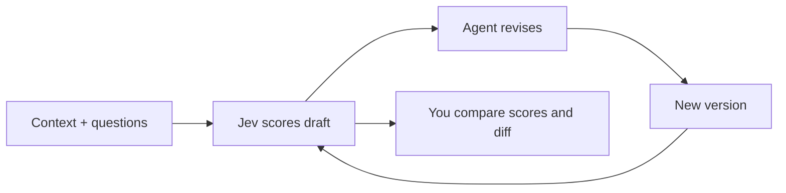

# Jev Score

[](https://github.com/a-Fig/jev-score/actions/workflows/ci.yml)
[](https://github.com/a-Fig/jev-score/releases/latest)
[](https://nodejs.org/)
[](./LICENSE)

## Give your coding agent a scoreboard

Most AI writing loops run on vibes: draft, rewrite, hope. **Jev Score turns that loop into evidence.**

Jev Score is a local CLI and web app for Codex, Claude Code, and other coding agents. Give it a document, the context that document must satisfy, and the questions that define “good.” It asks [TypeSafe's Jev](https://www.typesafe.ai/) to score every revision, keeps the full history, and shows whether the work is moving forward.

Use it to improve a resume against a job posting, an essay against its prompt, a spec against requirements, or a landing page against its positioning.


> **The screenshot is the proof:** Jev Score is being used to improve this README. The workspace above records its drafts, scores, criteria, and progress.

**Jump to:** [Try it locally](#try-it-locally) · [Score a document](#score-your-first-document) · [Use it with an agent](#run-the-loop-with-your-agent) · [Data and limits](#data-and-limits)

## One-minute tour

```text
Document:  This README
Context:   Product, audience, behavior, setup, proof, and constraints
Questions: Engagement · clarity · setup · proof · trust · polish

#0  Baseline README       84.6
#11 Use-case matrix       88.6   +4.0  ← best observed
```

Those are real Jev runs from this repository's README experiment. A score is a probabilistic signal, not an objective grade; the stored drafts and criterion-level results make the signal inspectable.

| Optimize | Against | Ask Jev |
| --- | --- | --- |
| Resume | Job posting | Fit, evidence, authenticity, ATS readability |
| Essay | Prompt or rubric | Argument, structure, originality, voice |
| Product spec | Requirements | Completeness, clarity, risks, testability |
| Landing page | Audience and positioning | Clarity, trust, differentiation, conversion intent |

Your agent works through the CLI. You inspect the same data in the localhost UI:



Jev Score evaluates, stores, and compares. Your coding agent handles the edits.

## Try it locally

You need [Node.js 22.13+](https://nodejs.org/) and an OpenRouter API key with access to Jev.

```bash
git clone https://github.com/a-Fig/jev-score.git
cd jev-score
npm install
cp .env.example .env.local
```

On PowerShell, replace the last command with `Copy-Item .env.example .env.local`. The multiline examples below use Bash continuations; in PowerShell, join each command onto one line or replace trailing `\` characters with backticks. Add your key:

```dotenv
OPENROUTER_API_KEY=your_key_here
OPENROUTER_JEV_MODEL=typesafe/jev-1.13
```

Start the app:

```bash
node ./bin/jev-score.mjs ui
```

Jev Score opens at [http://127.0.0.1:4317](http://127.0.0.1:4317). Pass `--port <number>` to use another port.

Install the command used below:

```bash
npm install --global .
jev-score --help
```

## Score your first document

An **evaluation group** is a reusable set of questions. A **workspace** combines one context with documents and evaluation history.

Each question has a direction. Higher is better by default; prefix a line in a text question file with `[lower]` for metrics such as red flags or error count. JSON question files can set `"direction": "higher"` or `"direction": "lower"`. The default overall score averages higher scores with `100 - score` for lower-is-better questions.

```bash
# 1. Define what a good resume means
jev-score group create \
  --name "Resume review" \
  --questions ./examples/resume/questions.txt

# 2. Create a workspace around the job posting
jev-score workspace create \
  --name "Product writer role" \
  --context ./examples/resume/job-posting.md \
  --context-title "Job posting" \
  --group "Resume review"

# 3. Store and evaluate the original
jev-score score "Product writer role" ./examples/resume/resume.md \
  --title "Original resume"
```

The command prints agent-friendly JSON with the overall score, every question score, model information, confidence data, and API usage. Open the UI whenever you want to inspect the workspace:

```bash
jev-score ui
```

## Inspect the experiment

- **Every draft.** Unique content is stored once, numbered `#0`, `#1`, `#2`, and optionally linked to its parent revision.
- **Every run.** Re-score the same document without duplicating it; Jev Score keeps each probabilistic result.
- **Batch catch-up.** Evaluate every document that has no completed run for the active group with one button.
- **Every criterion.** Compare documents in a compact question-by-document score table or rank by one question.
- **Actual changes.** Compare two rendered documents left and right, then switch to a GitHub-style line diff.
- **Progress.** See improvement from the original, the best-so-far frontier, highest and median rankings, ranges, and run counts.
- **Usage.** See locally recorded Jev token counts and OpenRouter costs in Settings or with `jev-score usage`.
- **Reusable rubrics.** Attach the same evaluation group to many workspaces and switch the primary group at any time.
- **Metric direction.** Mark each question as higher-is-better or lower-is-better; rankings, highlights, and the default overall score follow that direction.
- **Custom overall scores.** Weight criteria or define another formula with a small JavaScript scorer.

The CLI and UI operate on the same SQLite database. An agent can add and score a revision while the browser is open; refresh and it is there.

## Run the loop with your agent

The repository ships with an [agent skill](./.agents/skills/jev-score/SKILL.md). A typical iteration is two commands:

```bash
jev-score document add "Product writer role" ./resume-v2.md \
  --title "Quantified outcomes" \
  --summary "Added evidence and tightened the opening" \
  --parent "Original resume"

jev-score score "Product writer role" "Quantified outcomes" \
  --note "iteration 1"
```

Then rank every revision, overall or by one question:

```bash
jev-score rank "Product writer role"
jev-score rank "Product writer role" --question does-the-resume-demonstrate-strong-fit-for
```

Rankings use the highest score by default. Switch a workspace to median when repeatability matters more than one peak:

```bash
jev-score workspace mode "Product writer role" median
```

## Four ideas, one workflow

| Concept | What it means | Resume example |
| --- | --- | --- |
| **Context** | What the writing must satisfy | A job posting |
| **Document** | One unique stored draft | Original or revised resume |
| **Evaluation group** | Reusable questions that define quality | Fit, evidence, authenticity, ATS readability |
| **Run** | One Jev evaluation | Scores for `#2` against “Resume review” |

Groups lock after their first run so historical scores stay comparable. To change questions or scorer logic, create a new group.

## Custom scoring

Groups average their question scores by default. A trusted local JavaScript function can define the overall score:

```js
export default function score(scores) {
  return scores.role_fit * 0.5
    + scores.clarity * 0.3
    + (100 - scores.red_flags) * 0.2;
}
```

```bash
jev-score group create \
  --name "Weighted hiring review" \
  --questions ./examples/custom-questions.json \
  --scorer ./examples/custom-scorer.mjs
```

Jev Score stores the scorer source and hash and runs it in a short-lived worker. It is trusted local code, not a security sandbox. See [Custom scorers](./docs/custom-scorers.md) for the contract and failure behavior.

## Data and limits

| Question | Answer |
| --- | --- |
| **Where is my data?** | Documents, context, questions, and scores live in a local SQLite database. |
| **What leaves my machine?** | The evaluated document, workspace context, and questions are sent to OpenRouter for the Jev call. |
| **Are scores deterministic?** | No. Jev is probabilistic, so Jev Score keeps every run and shows medians and ranges. |
| **Does Jev Score edit documents?** | No. Your coding agent edits; Jev Score evaluates and records. |
| **Which files work?** | Text and Markdown. Convert PDF or Word files to text first. |
| **Is this a hosted team app?** | No. It is a single-user localhost tool with no remote hosting or multi-user authentication mode. |
| **Is it affiliated with TypeSafe or OpenRouter?** | No. Jev Score is an independent open-source project. |

Delete one workspace with `jev-score workspace delete "<workspace>" --yes`, or clear the active database with `jev-score db reset --yes`.

The database lives at `%LOCALAPPDATA%\jev-score\jev-score.db` on Windows, `~/Library/Application Support/jev-score/jev-score.db` on macOS, and `$XDG_DATA_HOME/jev-score/jev-score.db` on Linux, falling back to `~/.local/share/jev-score/jev-score.db` when `XDG_DATA_HOME` is unset. Override it with `JEV_SCORE_DB` or `JEV_SCORE_DATA_DIR`.

## CLI map

```text
jev-score workspace create|list|show|delete|primary|mode
jev-score group create|list|show|rename|delete|attach
jev-score document add|list|get
jev-score score <workspace> <document-or-file>
jev-score rank <workspace>
jev-score usage
jev-score ui [--port <port>]
jev-score serve [--port <port>]
jev-score db path|reset
```

Names and IDs both work as references. Run `jev-score --help` for the complete options.

## Development

```bash
npm test
npm run pack:check
npm start
```

CI tests Windows, macOS, and Linux. Read [CONTRIBUTING.md](./CONTRIBUTING.md) before opening a pull request. Jev Score is available under the [MIT License](./LICENSE).
