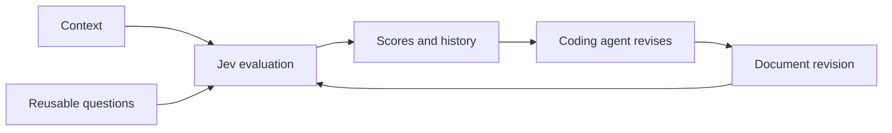

# Jev Score

[](https://github.com/a-Fig/jev-score/actions/workflows/ci.yml)
[](https://github.com/a-Fig/jev-score/releases/latest)
[](https://nodejs.org/)
[](./LICENSE)

**Give your coding agent a scoreboard for writing.**

Jev Score is a local-first CLI and web app that evaluates document revisions with [TypeSafe's Jev](https://www.typesafe.ai/) through OpenRouter. Codex or Claude Code can save each draft, score it against your context and questions, revise it, and repeat. You get a clean history of what changed and whether it actually improved.

Use it for resumes against job postings, essays against prompts, specs against requirements, landing pages against positioning, and any other text where “better” should be measurable.


## The loop



Jev Score handles storage, evaluation, and comparison. Your coding agent handles the edits and decides what to try next. The CLI and UI use the same SQLite database, so changes made by either appear immediately in both.

## Quick start

You need Node.js 22.13 or newer and an OpenRouter API key with access to Jev.

```bash
git clone https://github.com/a-Fig/jev-score.git
cd jev-score
npm install
cp .env.example .env.local
```

On PowerShell, use `Copy-Item .env.example .env.local`. Put your key in `.env.local`:

```dotenv
OPENROUTER_API_KEY=your_key_here
OPENROUTER_JEV_MODEL=typesafe/jev-1.13
```

Create a reusable evaluation group:

```bash
node ./bin/jev-score.mjs group create \
  --name "Resume review" \
  --questions ./examples/resume/questions.txt
```

Create a workspace around the job posting, then score the original resume:

```bash
node ./bin/jev-score.mjs workspace create \
  --name "Product writer" \
  --context ./examples/resume/job-posting.md \
  --context-title "Job posting" \
  --group "Resume review"

node ./bin/jev-score.mjs score \
  "Product writer" ./examples/resume/resume.md \
  --title "Original resume"
```

Open the local interface:

```bash
node ./bin/jev-score.mjs ui
```

The default address is [http://127.0.0.1:4317](http://127.0.0.1:4317). Use `--port <number>` if that port is occupied.

Install the command globally when you want `jev-score` available outside the checkout:

```bash
npm install --global .
jev-score --help
```

## What you get

- **Context-centered workspaces** for a job posting, prompt, specification, rubric, or brief.
- **Reusable evaluation groups** with stable questions that can be attached to multiple workspaces.
- **Complete draft history** with titles, change summaries, parent revisions, and full document retrieval.
- **Content deduplication** by SHA-256, while every evaluation remains a separate run.
- **Useful score summaries**: median, minimum, maximum, spread, run count, and question-level results.
- **Flexible rankings** by overall score or one question, using highest-ever or median mode.
- **Side-by-side comparison** of every score and rendered Markdown, with a source view when you need the exact text.
- **Visible progress** through original/best badges, per-run changes, and a best-so-far chart.
- **Custom overall scores** for weighting or lower-is-better criteria.
- **Agent-friendly JSON** from every data command and a project-local agent skill.
- **No runtime dependencies** beyond Node.js.

## A real result

`score` saves a new file before it calls Jev. Re-scoring identical content creates another run without duplicating the document.

```json
{
  "documentTitle": "Original resume",
  "groupName": "Resume review",
  "status": "success",
  "overallScore": 83.4,
  "scores": [
    { "text": "Is the resume organized and easy to scan?", "score": 85.3 },
    { "text": "Does the resume demonstrate strong fit for the role?", "score": 89.5 },
    { "text": "Does the resume feel authentic?", "score": 78.3 }
  ]
}
```

The response also contains confidence, probability distributions, model details, and API usage.

## Working with a coding agent

The repository includes an [agent skill](./.agents/skills/jev-score/SKILL.md). A typical iteration looks like this:

```bash
# Store a revision and explain what changed
jev-score document add "Product writer" ./resume-v2.md \
  --title "Stronger outcomes" \
  --summary "Quantified impact and tightened the opening" \
  --parent "Original resume"

# Evaluate it
jev-score score "Product writer" "Stronger outcomes" --note "iteration 2"

# Compare every revision
jev-score rank "Product writer"

# Or rank by one question
jev-score rank "Product writer" \
  --question does-the-resume-demonstrate-strong-fit-for
```

Switch to median ranking when you care more about repeatability than one peak result:

```bash
jev-score workspace mode "Product writer" median
```

## Custom overall scoring

Groups use the arithmetic mean by default. A small JavaScript function can add weights or invert a lower-is-better question:

```js
export default function score(scores) {
  return scores.role_fit * 0.7 + (100 - scores.red_flags) * 0.3;
}
```

```bash
jev-score group create \
  --name "Weighted hiring review" \
  --questions ./examples/custom-questions.json \
  --scorer ./examples/custom-scorer.mjs
```

The scorer source and hash are stored with the group. Scorer code is trusted local code; only use files you trust. See [Custom scorers](./docs/custom-scorers.md) for the full contract and failure behavior.

## CLI reference

```text
jev-score workspace create|list|show|delete|primary|mode
jev-score group create|list|show|rename|delete|attach
jev-score document add|list|get
jev-score score <workspace> <document-or-file>
jev-score rank <workspace>
jev-score ui [--port <port>]
jev-score serve [--port <port>]
jev-score db path|reset
```

Names and IDs are accepted as references. Run `jev-score --help` for every option.

## Data, privacy, and limits

- Documents, context, and scores are stored locally in SQLite. Evaluated documents, context, and questions are sent to OpenRouter.
- The web app binds only to `127.0.0.1` and rejects cross-origin mutations. It has no multi-user authentication or remote-hosting mode.
- Jev is probabilistic. Repeated runs may differ, which is why Jev Score keeps every run and supports median ranking.
- The current document workflow accepts text and Markdown. Convert PDF or Word files to text first.
- Custom scorer modules are trusted local JavaScript, not a security sandbox.
- Jev Score is an independent open-source project and is not affiliated with TypeSafe or OpenRouter.

The default database location is `%LOCALAPPDATA%\jev-score\jev-score.db` on Windows, `~/Library/Application Support/jev-score/jev-score.db` on macOS, and `$XDG_DATA_HOME/jev-score/jev-score.db` on Linux. Override it with `JEV_SCORE_DB` or `JEV_SCORE_DATA_DIR`.

Delete one workspace with `workspace delete --yes`, or clear the active database with `db reset --yes`.

## Development

```bash
npm test
npm run pack:check
npm start
```

CI runs on Windows, macOS, and Linux. Read [CONTRIBUTING.md](./CONTRIBUTING.md) before opening a pull request. Jev Score is available under the [MIT License](./LICENSE).
